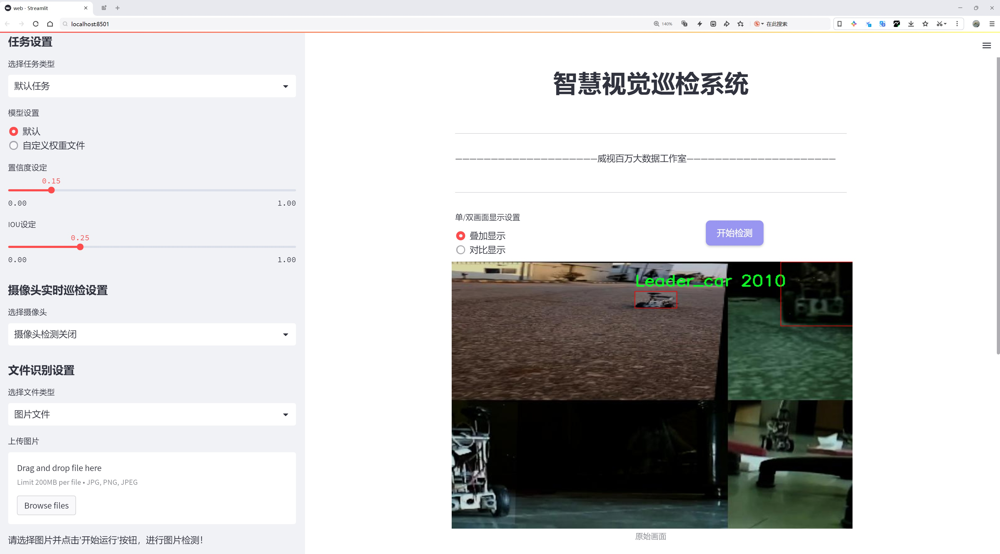
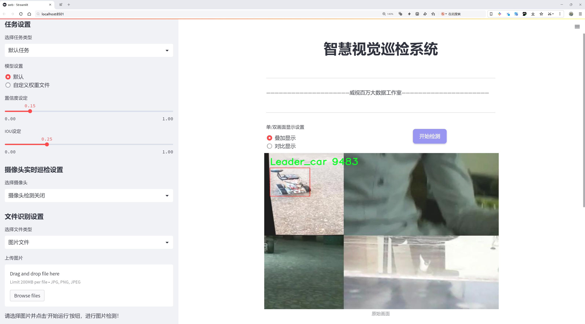
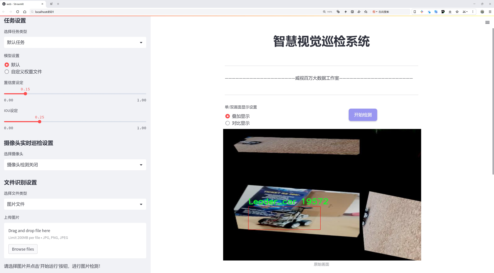
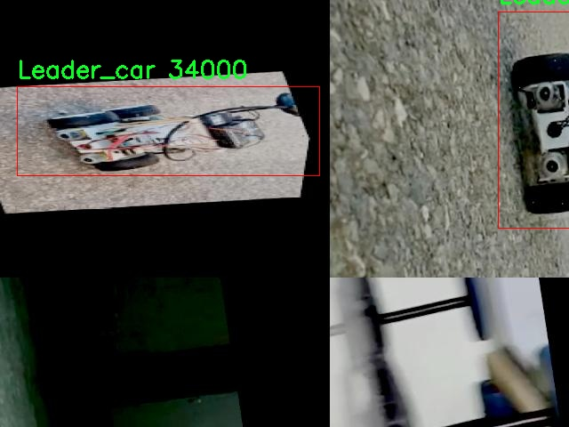
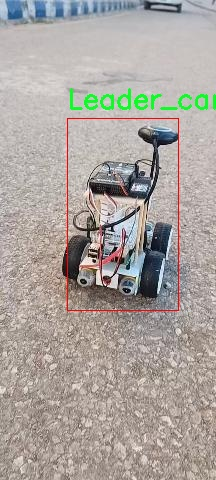
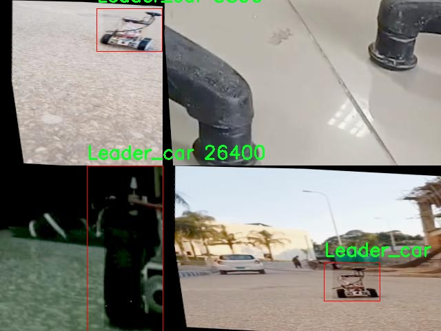
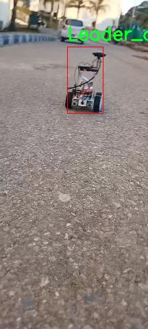
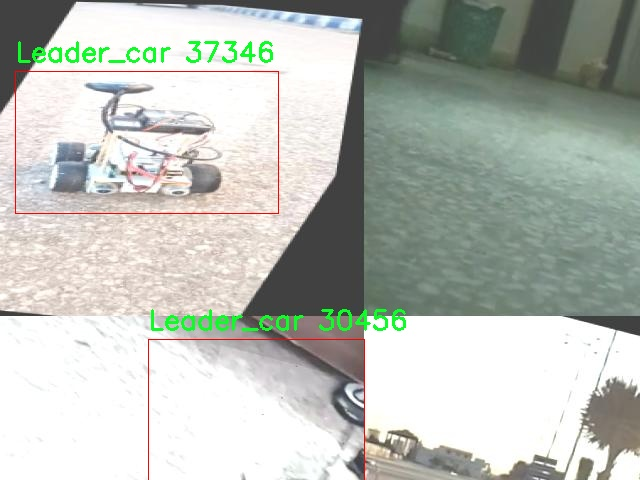

# 玩具车检测检测系统源码分享
 # [一条龙教学YOLOV8标注好的数据集一键训练_70+全套改进创新点发刊_Web前端展示]

### 1.研究背景与意义

项目参考[AAAI Association for the Advancement of Artificial Intelligence](https://gitee.com/qunshansj/projects)

项目来源[AACV Association for the Advancement of Computer Vision](https://gitee.com/qunmasj/projects)

研究背景与意义

随着智能科技的迅猛发展，计算机视觉技术在各个领域的应用日益广泛，尤其是在物体检测和识别方面。玩具车作为儿童玩具市场的重要组成部分，其检测与识别技术的研究不仅具有重要的学术价值，也对实际应用具有深远的影响。传统的玩具车检测方法往往依赖于人工标注和特征提取，效率低下且容易受到环境因素的影响。近年来，深度学习特别是卷积神经网络（CNN）的发展为物体检测提供了新的思路和方法。YOLO（You Only Look Once）系列模型因其高效性和实时性而备受关注，尤其是YOLOv8模型在精度和速度上的显著提升，使其成为物体检测领域的热门选择。

本研究旨在基于改进的YOLOv8模型，构建一个高效的玩具车检测系统。通过对Leader_Annotation数据集的分析，我们发现该数据集包含3500张标注图像，专注于玩具车这一单一类别的检测，提供了良好的基础。该数据集的构建不仅为模型训练提供了丰富的样本，也为后续的算法优化提供了数据支持。玩具车的多样性和复杂性为检测系统的准确性提出了挑战，因此，改进YOLOv8模型以适应特定场景的需求显得尤为重要。

在玩具车检测系统的研究中，改进YOLOv8模型的意义在于提升检测精度和实时性。通过对模型架构的优化、损失函数的调整以及数据增强技术的应用，我们期望能够显著提高模型在复杂环境下的表现。此外，玩具车的检测不仅限于静态图像的分析，还可以扩展到视频流的实时处理，这对于智能玩具、自动驾驶小车等应用场景具有重要的现实意义。

本研究的意义还在于推动计算机视觉技术在儿童玩具领域的应用。随着智能玩具的普及，如何实现对玩具的智能识别和互动成为一个亟待解决的问题。通过构建高效的玩具车检测系统，我们可以为智能玩具的开发提供技术支持，进而推动儿童教育和娱乐方式的创新。此外，该系统的成功实施也将为其他物体检测任务提供借鉴，促进计算机视觉技术在更多领域的应用。

综上所述，基于改进YOLOv8的玩具车检测系统的研究，不仅具有重要的理论价值，也具有广泛的应用前景。通过深入探讨玩具车的检测技术，我们期望能够为智能玩具的发展贡献力量，同时为相关领域的研究提供新的思路和方法。

### 2.图片演示







##### 注意：由于此博客编辑较早，上面“2.图片演示”和“3.视频演示”展示的系统图片或者视频可能为老版本，新版本在老版本的基础上升级如下：（实际效果以升级的新版本为准）

  （1）适配了YOLOV8的“目标检测”模型和“实例分割”模型，通过加载相应的权重（.pt）文件即可自适应加载模型。

  （2）支持“图片识别”、“视频识别”、“摄像头实时识别”三种识别模式。

  （3）支持“图片识别”、“视频识别”、“摄像头实时识别”三种识别结果保存导出，解决手动导出（容易卡顿出现爆内存）存在的问题，识别完自动保存结果并导出到tempDir中。

  （4）支持Web前端系统中的标题、背景图等自定义修改，后面提供修改教程。

  另外本项目提供训练的数据集和训练教程,暂不提供权重文件（best.pt）,需要您按照教程进行训练后实现图片演示和Web前端界面演示的效果。

### 3.视频演示

[3.1 视频演示](https://www.bilibili.com/video/BV19EtJezEMc/)

### 4.数据集信息展示

##### 4.1 本项目数据集详细数据（类别数＆类别名）

nc: 1
names: ['Leader_car']


##### 4.2 本项目数据集信息介绍

数据集信息展示

在本研究中，我们采用了名为“Leader_Annotation”的数据集，以训练和改进YOLOv8模型，专注于玩具车的检测系统。该数据集的设计旨在提供高质量的标注数据，以支持计算机视觉领域的相关研究和应用。数据集的核心目标是通过精确的标注和丰富的样本，提升YOLOv8在玩具车检测任务中的性能和准确性。

“Leader_Annotation”数据集的类别数量为1，具体类别为“Leader_car”。这一类别的设置反映了我们研究的专一性和针对性，旨在集中资源和精力于玩具车的检测与识别。玩具车作为一种常见的物体，具有多样的形状、颜色和尺寸特征，因此在数据集的构建过程中，我们特别关注了样本的多样性和代表性，以确保模型能够在不同场景下有效地进行检测。

数据集的构建涉及多个步骤，包括数据收集、标注和预处理。我们从多个来源收集了大量的玩具车图像，确保涵盖各种环境和背景，以增强模型的泛化能力。每一张图像都经过精细的标注，确保“Leader_car”这一类别的每个实例都被准确地框定和标识。这种精确的标注不仅提高了数据集的质量，也为后续的模型训练提供了坚实的基础。

在数据预处理阶段，我们对图像进行了多种处理，包括缩放、裁剪和颜色调整，以适应YOLOv8模型的输入要求。这些处理步骤旨在提高模型的训练效率和准确性，使其能够更好地适应不同的输入条件。此外，我们还对数据集进行了划分，确保训练集、验证集和测试集的合理比例，以便在模型训练和评估过程中获得可靠的结果。

通过使用“Leader_Annotation”数据集，我们期望能够显著提升YOLOv8在玩具车检测任务中的表现。该数据集不仅为模型提供了丰富的训练样本，还通过精确的标注信息，帮助模型学习到玩具车的特征和模式。这一过程将有助于实现更高的检测精度和更快的推理速度，从而推动玩具车检测技术的发展。

总之，“Leader_Annotation”数据集在本研究中扮演了至关重要的角色。它不仅为YOLOv8模型的训练提供了必要的数据支持，还通过精细的标注和多样的样本，增强了模型的学习能力和适应性。我们相信，通过对该数据集的有效利用，能够为玩具车检测系统的改进和应用奠定坚实的基础，推动相关技术的进步与创新。











### 5.全套项目环境部署视频教程（零基础手把手教学）

[5.1 环境部署教程链接（零基础手把手教学）](https://www.ixigua.com/7404473917358506534?logTag=c807d0cbc21c0ef59de5)


[5.2 安装Python虚拟环境创建和依赖库安装视频教程链接（零基础手把手教学）](https://www.ixigua.com/7404474678003106304?logTag=1f1041108cd1f708b01a)

### 6.手把手YOLOV8训练视频教程（零基础小白有手就能学会）

[6.1 手把手YOLOV8训练视频教程（零基础小白有手就能学会）](https://www.ixigua.com/7404477157818401292?logTag=d31a2dfd1983c9668658)

### 7.70+种全套YOLOV8创新点代码加载调参视频教程（一键加载写好的改进模型的配置文件）

[7.1 70+种全套YOLOV8创新点代码加载调参视频教程（一键加载写好的改进模型的配置文件）](https://www.ixigua.com/7404478314661806627?logTag=29066f8288e3f4eea3a4)

### 8.70+种全套YOLOV8创新点原理讲解（非科班也可以轻松写刊发刊，V10版本正在科研待更新）

由于篇幅限制，每个创新点的具体原理讲解就不一一展开，具体见下列网址中的创新点对应子项目的技术原理博客网址【Blog】：


[8.1 70+种全套YOLOV8创新点原理讲解链接](https://gitee.com/qunmasj/good)

### 9.系统功能展示（检测对象为举例，实际内容以本项目数据集为准）

图9.1.系统支持检测结果表格显示

  图9.2.系统支持置信度和IOU阈值手动调节

  图9.3.系统支持自定义加载权重文件best.pt(需要你通过步骤5中训练获得)

  图9.4.系统支持摄像头实时识别

  图9.5.系统支持图片识别

  图9.6.系统支持视频识别

  图9.7.系统支持识别结果文件自动保存

  图9.8.系统支持Excel导出检测结果数据


### 10.原始YOLOV8算法原理

原始YOLOv8算法原理

YOLOv8（You Only Look Once version 8）作为目标检测领域的最新进展，承载着前几代YOLO模型的优良传统，同时在其基础上进行了深度的优化与创新。其核心思想依然是实时目标检测，但通过引入更为高效的网络结构和算法，YOLOv8在速度和精度上都取得了显著的提升。YOLOv8的设计理念是将目标检测的各个环节进行精细化的处理，从而在保证实时性的同时，最大化地提高检测的准确性。

YOLOv8的网络结构主要由三个部分组成：Backbone、Neck和Head。Backbone部分负责特征提取，采用了CSPDarknet（Cross Stage Partial Darknet）结构，这种结构通过引入多个残差块，使得特征提取过程更加高效。与前代模型相比，YOLOv8在Backbone中使用了C2F模块替代了C3模块。C2F模块的设计理念是将输入特征图分为两个分支，每个分支经过卷积层进行降维处理，从而在保留特征信息的同时，减少了计算量。这种分支结构不仅提升了特征的多样性，还有效增强了梯度流的传递，使得模型在训练过程中能够更好地学习到有用的特征。

在特征融合阶段，YOLOv8引入了特征金字塔网络（FPN）与路径聚合网络（PAN）的结合，形成了一个高效的特征融合网络。特征金字塔网络通过多尺度特征的提取，能够有效地处理不同大小的目标，而路径聚合网络则通过连接不同层次的特征，增强了信息的流动性。为了进一步提升特征融合的效率，YOLOv8还采用了BiFPN（Bidirectional Feature Pyramid Network）结构。这一结构通过双向跨尺度连接和加权特征融合，能够更好地整合来自不同层次的特征信息，提升了模型对不同尺度目标的检测能力。

在Head部分，YOLOv8采用了解耦头（Decoupled Head）替代了传统的耦合头（Coupled Head），这一设计使得模型能够独立地预测目标的类别和位置，进一步提高了检测的准确性。YOLOv8还引入了无锚框（Anchor-Free）检测方式，直接预测目标的中心点和宽高比例，这一创新减少了对Anchor框的依赖，简化了模型的设计，同时提高了检测速度和准确度。

YOLOv8的轻量化版本YOLOv8n则在此基础上进行了进一步的优化。YOLOv8n在Backbone中使用了更轻量化的C2F模块，采用3×3的卷积核，深度设置为3、6、6、3，从而在保持特征提取能力的同时，显著降低了模型的复杂度。此外，在特征融合层中，YOLOv8n减少了降采样层的数量，进一步提升了模型的速度。通过这些优化，YOLOv8n不仅能够在资源受限的环境中运行，还能在实时应用中保持高效的检测性能。

YOLOv8的模型设置灵活多样，支持不同的深度和宽度因子调整。通过设置depth_factor和width_factor，用户可以根据具体需求调整模型的复杂度，以适应不同的应用场景。YOLOv8的基础通道数为512，最大通道数可达到1024，这一设计使得模型在保持高效性的同时，具备了良好的扩展性。

总的来说，YOLOv8在目标检测领域的创新与优化，体现了深度学习技术的不断进步。通过高效的特征提取、灵活的特征融合以及精准的目标检测策略，YOLOv8不仅提升了目标检测的速度和准确性，也为实际应用提供了更为广泛的可能性。无论是在自动驾驶、安防监控，还是在智能制造等领域，YOLOv8都展现出了其强大的应用潜力和广泛的适用性。随着YOLOv8的推广与应用，目标检测技术将迎来新的发展机遇，为各行各业的智能化进程注入新的动力。


### 11.项目核心源码讲解（再也不用担心看不懂代码逻辑）

#### 11.1 ui.py

以下是对代码的核心部分进行提炼和详细注释的版本：

```python
import sys
import subprocess

def run_script(script_path):
    """
    使用当前 Python 环境运行指定的脚本。

    Args:
        script_path (str): 要运行的脚本路径

    Returns:
        None
    """
    # 获取当前 Python 解释器的路径
    python_path = sys.executable

    # 构建运行命令，使用 streamlit 运行指定的脚本
    command = f'"{python_path}" -m streamlit run "{script_path}"'

    # 执行命令并等待其完成
    result = subprocess.run(command, shell=True)
    
    # 检查命令执行结果，如果返回码不为0，表示执行出错
    if result.returncode != 0:
        print("脚本运行出错。")

# 主程序入口
if __name__ == "__main__":
    # 指定要运行的脚本路径
    script_path = "web.py"  # 这里可以直接指定脚本名，假设它在当前目录下

    # 调用函数运行指定的脚本
    run_script(script_path)
```

### 代码分析与注释：
1. **导入模块**：
   - `sys`：用于获取当前 Python 解释器的路径。
   - `subprocess`：用于执行外部命令。

2. **`run_script` 函数**：
   - **参数**：接收一个字符串参数 `script_path`，表示要运行的 Python 脚本的路径。
   - **功能**：构建并执行一个命令来运行指定的脚本，使用 `streamlit` 模块。

3. **获取 Python 解释器路径**：
   - `sys.executable`：返回当前 Python 解释器的完整路径，用于确保在正确的环境中运行脚本。

4. **构建命令**：
   - 使用格式化字符串构建命令，命令的格式为 `python -m streamlit run script_path`，其中 `script_path` 是传入的脚本路径。

5. **执行命令**：
   - `subprocess.run`：执行构建的命令，`shell=True` 允许在 shell 中执行命令。
   - `result.returncode`：检查命令的返回码，如果不为0，表示脚本运行失败，打印错误信息。

6. **主程序入口**：
   - `if __name__ == "__main__":`：确保只有在直接运行该脚本时才会执行以下代码。
   - 指定要运行的脚本路径为 `web.py`，然后调用 `run_script` 函数执行该脚本。

这个简化的版本保留了核心功能，并且添加了详细的中文注释，便于理解代码的每个部分。

这个文件是一个 Python 脚本，主要功能是运行一个名为 `web.py` 的脚本。它通过使用当前 Python 环境来执行这个脚本，并且使用了 `subprocess` 模块来处理外部命令的执行。

首先，文件导入了几个必要的模块，包括 `sys`、`os` 和 `subprocess`。其中，`sys` 模块用于访问与 Python 解释器相关的变量和函数，`os` 模块提供了与操作系统交互的功能，而 `subprocess` 模块则用于创建新进程、连接到它们的输入/输出/错误管道，并获取它们的返回码。

接下来，定义了一个名为 `run_script` 的函数，这个函数接受一个参数 `script_path`，表示要运行的脚本的路径。在函数内部，首先获取当前 Python 解释器的路径，存储在 `python_path` 变量中。然后，构建一个命令字符串，该命令使用当前的 Python 解释器来运行指定的脚本，命令格式为 `python -m streamlit run script_path`。

使用 `subprocess.run` 方法执行这个命令，`shell=True` 参数允许在 shell 中执行命令。执行完命令后，检查返回码，如果返回码不为 0，表示脚本运行出错，程序会打印出错误信息。

在文件的最后部分，使用 `if __name__ == "__main__":` 语句来确保只有在直接运行该脚本时才会执行以下代码。这里指定了要运行的脚本路径为 `web.py`，并调用 `run_script` 函数来执行这个脚本。

总的来说，这个文件的主要作用是提供一个简单的接口来运行一个特定的 Python 脚本，便于在当前环境中启动相关的应用程序。

#### 11.2 code\ultralytics\models\yolo\segment\predict.py

以下是代码中最核心的部分，并附上详细的中文注释：

```python
from ultralytics.engine.results import Results  # 导入结果处理类
from ultralytics.models.yolo.detect.predict import DetectionPredictor  # 导入检测预测器基类
from ultralytics.utils import DEFAULT_CFG, ops  # 导入默认配置和操作工具

class SegmentationPredictor(DetectionPredictor):
    """
    扩展DetectionPredictor类，用于基于分割模型的预测。
    """

    def __init__(self, cfg=DEFAULT_CFG, overrides=None, _callbacks=None):
        """初始化SegmentationPredictor，使用提供的配置、覆盖参数和回调函数。"""
        super().__init__(cfg, overrides, _callbacks)  # 调用父类构造函数
        self.args.task = "segment"  # 设置任务类型为分割

    def postprocess(self, preds, img, orig_imgs):
        """对每个输入图像批次应用非极大值抑制，并处理检测结果。"""
        # 应用非极大值抑制，过滤掉低置信度的检测框
        p = ops.non_max_suppression(
            preds[0],  # 预测结果
            self.args.conf,  # 置信度阈值
            self.args.iou,  # IOU阈值
            agnostic=self.args.agnostic_nms,  # 是否使用类别无关的NMS
            max_det=self.args.max_det,  # 最大检测框数量
            nc=len(self.model.names),  # 类别数量
            classes=self.args.classes,  # 指定的类别
        )

        # 如果输入图像不是列表，则将其转换为numpy数组
        if not isinstance(orig_imgs, list):
            orig_imgs = ops.convert_torch2numpy_batch(orig_imgs)

        results = []  # 存储结果的列表
        proto = preds[1][-1] if len(preds[1]) == 3 else preds[1]  # 获取掩码原型

        # 遍历每个预测结果
        for i, pred in enumerate(p):
            orig_img = orig_imgs[i]  # 获取原始图像
            img_path = self.batch[0][i]  # 获取图像路径

            if not len(pred):  # 如果没有检测到框
                masks = None  # 掩码设置为None
            elif self.args.retina_masks:  # 如果使用Retina掩码
                # 缩放检测框到原始图像大小
                pred[:, :4] = ops.scale_boxes(img.shape[2:], pred[:, :4], orig_img.shape)
                # 处理掩码
                masks = ops.process_mask_native(proto[i], pred[:, 6:], pred[:, :4], orig_img.shape[:2])  # HWC
            else:  # 否则使用常规掩码处理
                masks = ops.process_mask(proto[i], pred[:, 6:], pred[:, :4], img.shape[2:], upsample=True)  # HWC
                # 缩放检测框到原始图像大小
                pred[:, :4] = ops.scale_boxes(img.shape[2:], pred[:, :4], orig_img.shape)

            # 将结果存储到Results对象中
            results.append(Results(orig_img, path=img_path, names=self.model.names, boxes=pred[:, :6], masks=masks))

        return results  # 返回处理后的结果
```

### 代码核心部分说明：
1. **类定义**：`SegmentationPredictor`类继承自`DetectionPredictor`，用于处理图像分割任务。
2. **初始化方法**：在构造函数中，调用父类的构造函数并设置任务类型为分割。
3. **后处理方法**：`postprocess`方法对模型的预测结果进行后处理，包括非极大值抑制、掩码处理和结果存储。根据不同的条件处理检测框和掩码，并将最终结果封装到`Results`对象中返回。

这个程序文件是Ultralytics YOLO模型库中的一个模块，专门用于基于分割模型进行预测。文件名为`predict.py`，它定义了一个名为`SegmentationPredictor`的类，该类继承自`DetectionPredictor`，用于处理图像分割任务。

在文件的开头，首先导入了一些必要的模块和类，包括`Results`、`DetectionPredictor`和一些工具函数。`Results`类用于存储预测结果，`DetectionPredictor`是一个基础类，提供了检测功能，而`ops`模块则包含了一些操作函数。

`SegmentationPredictor`类的构造函数`__init__`接受三个参数：`cfg`（配置），`overrides`（覆盖参数），和`_callbacks`（回调函数）。在构造函数中，调用了父类的构造函数，并将任务类型设置为“segment”，表示这是一个分割任务的预测器。

类中最重要的方法是`postprocess`，该方法用于对模型的预测结果进行后处理。它接受三个参数：`preds`（预测结果）、`img`（输入图像）和`orig_imgs`（原始图像）。在该方法中，首先使用非极大值抑制（NMS）来过滤预测结果，以减少重叠的框。接着，如果输入的原始图像不是列表，则将其转换为NumPy数组。

然后，程序处理每个预测结果。根据预测的数量和类型，提取相应的掩膜（masks）。如果没有检测到目标，掩膜将被设置为`None`。如果设置了`retina_masks`，则使用原生的掩膜处理方法；否则，使用标准的掩膜处理方法。最后，程序将处理后的结果存储在`Results`对象中，并将其添加到结果列表中。

最终，`postprocess`方法返回一个包含所有预测结果的列表，每个结果包括原始图像、图像路径、类别名称、边界框和掩膜。这使得用户能够方便地访问和使用分割模型的预测结果。

#### 11.3 70+种YOLOv8算法改进源码大全和调试加载训练教程（非必要）\ultralytics\models\yolo\pose\val.py

以下是代码中最核心的部分，并附上详细的中文注释：

```python
class PoseValidator(DetectionValidator):
    """
    PoseValidator类扩展了DetectionValidator类，用于基于姿态模型的验证。
    """

    def __init__(self, dataloader=None, save_dir=None, pbar=None, args=None, _callbacks=None):
        """初始化PoseValidator对象，设置自定义参数和属性。"""
        super().__init__(dataloader, save_dir, pbar, args, _callbacks)  # 调用父类构造函数
        self.sigma = None  # 用于计算OKS的标准差
        self.kpt_shape = None  # 关键点的形状
        self.args.task = 'pose'  # 设置任务类型为姿态估计
        self.metrics = PoseMetrics(save_dir=self.save_dir, on_plot=self.on_plot)  # 初始化姿态估计指标

    def preprocess(self, batch):
        """预处理批次数据，将关键点数据转换为浮点数并移动到指定设备。"""
        batch = super().preprocess(batch)  # 调用父类的预处理方法
        batch['keypoints'] = batch['keypoints'].to(self.device).float()  # 将关键点数据转移到设备并转换为浮点数
        return batch

    def postprocess(self, preds):
        """应用非极大值抑制，返回高置信度的检测结果。"""
        return ops.non_max_suppression(preds,
                                       self.args.conf,
                                       self.args.iou,
                                       labels=self.lb,
                                       multi_label=True,
                                       agnostic=self.args.single_cls,
                                       max_det=self.args.max_det,
                                       nc=self.nc)  # 调用非极大值抑制函数

    def update_metrics(self, preds, batch):
        """更新指标，计算预测结果与真实标签之间的匹配情况。"""
        for si, pred in enumerate(preds):  # 遍历每个预测结果
            idx = batch['batch_idx'] == si  # 获取当前批次的索引
            cls = batch['cls'][idx]  # 获取当前批次的类别
            bbox = batch['bboxes'][idx]  # 获取当前批次的边界框
            kpts = batch['keypoints'][idx]  # 获取当前批次的关键点
            nl, npr = cls.shape[0], pred.shape[0]  # 标签数量和预测数量
            nk = kpts.shape[1]  # 关键点数量
            shape = batch['ori_shape'][si]  # 原始图像的形状
            correct_kpts = torch.zeros(npr, self.niou, dtype=torch.bool, device=self.device)  # 初始化正确关键点矩阵
            correct_bboxes = torch.zeros(npr, self.niou, dtype=torch.bool, device=self.device)  # 初始化正确边界框矩阵
            self.seen += 1  # 更新已处理的样本数量

            if npr == 0:  # 如果没有预测结果
                if nl:  # 如果有标签
                    self.stats.append((correct_bboxes, correct_kpts, *torch.zeros(
                        (2, 0), device=self.device), cls.squeeze(-1)))  # 记录统计信息
                continue  # 继续下一个批次

            # 处理预测结果
            predn = pred.clone()  # 克隆预测结果
            ops.scale_boxes(batch['img'][si].shape[1:], predn[:, :4], shape,
                            ratio_pad=batch['ratio_pad'][si])  # 将预测框缩放到原始图像大小
            pred_kpts = predn[:, 6:].view(npr, nk, -1)  # 获取预测的关键点
            ops.scale_coords(batch['img'][si].shape[1:], pred_kpts, shape, ratio_pad=batch['ratio_pad'][si])  # 缩放关键点

            # 评估
            if nl:  # 如果有标签
                height, width = batch['img'].shape[2:]  # 获取图像的高度和宽度
                tbox = ops.xywh2xyxy(bbox) * torch.tensor(
                    (width, height, width, height), device=self.device)  # 将目标框转换为xyxy格式
                ops.scale_boxes(batch['img'][si].shape[1:], tbox, shape,
                                ratio_pad=batch['ratio_pad'][si])  # 缩放目标框
                tkpts = kpts.clone()  # 克隆真实关键点
                tkpts[..., 0] *= width  # 缩放x坐标
                tkpts[..., 1] *= height  # 缩放y坐标
                tkpts = ops.scale_coords(batch['img'][si].shape[1:], tkpts, shape, ratio_pad=batch['ratio_pad'][si])  # 缩放关键点
                labelsn = torch.cat((cls, tbox), 1)  # 合并类别和目标框
                correct_bboxes = self._process_batch(predn[:, :6], labelsn)  # 处理边界框
                correct_kpts = self._process_batch(predn[:, :6], labelsn, pred_kpts, tkpts)  # 处理关键点

            # 记录统计信息
            self.stats.append((correct_bboxes, correct_kpts, pred[:, 4], pred[:, 5], cls.squeeze(-1)))

    def _process_batch(self, detections, labels, pred_kpts=None, gt_kpts=None):
        """
        返回正确的预测矩阵。

        参数:
            detections (torch.Tensor): 形状为[N, 6]的检测结果张量。
            labels (torch.Tensor): 形状为[M, 5]的标签张量。
            pred_kpts (torch.Tensor, 可选): 形状为[N, 51]的预测关键点张量。
            gt_kpts (torch.Tensor, 可选): 形状为[N, 51]的真实关键点张量。

        返回:
            torch.Tensor: 形状为[N, 10]的正确预测矩阵。
        """
        if pred_kpts is not None and gt_kpts is not None:  # 如果有预测和真实关键点
            area = ops.xyxy2xywh(labels[:, 1:])[:, 2:].prod(1) * 0.53  # 计算区域
            iou = kpt_iou(gt_kpts, pred_kpts, sigma=self.sigma, area=area)  # 计算关键点的IoU
        else:  # 处理边界框
            iou = box_iou(labels[:, 1:], detections[:, :4])  # 计算边界框的IoU

        return self.match_predictions(detections[:, 5], labels[:, 0], iou)  # 返回匹配的预测结果
```

### 代码说明
1. **PoseValidator类**：这是一个用于姿态估计的验证器，继承自`DetectionValidator`类，主要用于处理和评估姿态检测模型的性能。
2. **初始化方法**：设置了一些必要的参数，包括设备、任务类型、指标等。
3. **预处理方法**：将输入批次中的关键点数据转换为浮点数并移动到指定设备。
4. **后处理方法**：使用非极大值抑制来过滤低置信度的检测结果。
5. **更新指标方法**：根据预测结果和真实标签更新模型的性能指标，包括边界框和关键点的匹配情况。
6. **处理批次方法**：计算预测与真实标签之间的匹配情况，返回正确的预测矩阵。

这个程序文件是用于YOLOv8模型的姿态估计验证的实现，主要通过扩展`DetectionValidator`类来实现特定于姿态模型的验证功能。文件中包含了多个方法，分别负责数据预处理、后处理、指标更新、绘图和结果保存等功能。

首先，`PoseValidator`类继承自`DetectionValidator`，并在初始化时设置了一些特定的参数，如任务类型为“pose”，并初始化姿态估计的指标。它还会检查设备类型，如果是Apple的MPS设备，则会发出警告，建议使用CPU进行姿态模型的推理。

在`preprocess`方法中，输入的批次数据会被处理，将关键点数据转换为浮点数并移动到指定的设备上。`get_desc`方法返回评估指标的描述信息，便于后续的结果展示。

`postprocess`方法负责对模型的预测结果进行非极大值抑制，筛选出高置信度的检测结果。`init_metrics`方法则初始化姿态估计的指标，包括计算每个关键点的标准差（sigma），以便后续的评估使用。

在`update_metrics`方法中，程序会更新每个批次的预测结果和真实标签之间的匹配情况，计算出正确的边界框和关键点，并将这些结果存储到统计信息中。该方法还支持将预测结果保存为JSON格式，以便后续分析。

`_process_batch`方法用于处理每个批次的检测结果和标签，计算IoU（交并比）并返回正确的预测矩阵。`plot_val_samples`和`plot_predictions`方法则负责绘制验证样本和模型预测结果的图像，便于可视化分析。

最后，`pred_to_json`方法将YOLO的预测结果转换为COCO格式的JSON文件，方便与其他工具进行兼容和评估。`eval_json`方法则用于使用COCO格式的JSON文件评估模型的性能，计算mAP（平均精度均值）等指标。

总体来说，这个文件提供了一整套用于姿态估计模型验证的工具，涵盖了从数据预处理到结果评估的各个环节，适合在YOLOv8模型的训练和验证过程中使用。

#### 11.4 70+种YOLOv8算法改进源码大全和调试加载训练教程（非必要）\ultralytics\models\yolo\classify\__init__.py

```python
# 导入Ultralytics YOLO库中的分类模型相关模块
# Ultralytics YOLO 🚀, AGPL-3.0 许可证

# 从ultralytics.models.yolo.classify.predict模块导入分类预测器
from ultralytics.models.yolo.classify.predict import ClassificationPredictor

# 从ultralytics.models.yolo.classify.train模块导入分类训练器
from ultralytics.models.yolo.classify.train import ClassificationTrainer

# 从ultralytics.models.yolo.classify.val模块导入分类验证器
from ultralytics.models.yolo.classify.val import ClassificationValidator

# 定义模块的公开接口，包含分类预测器、分类训练器和分类验证器
__all__ = 'ClassificationPredictor', 'ClassificationTrainer', 'ClassificationValidator'
```

### 代码注释说明：
1. **导入模块**：该代码从Ultralytics YOLO库中导入了三个主要的模块，分别用于分类预测、分类训练和分类验证。这些模块是YOLO模型进行图像分类任务的核心组成部分。
   
2. **`ClassificationPredictor`**：用于对图像进行分类预测的类，能够加载训练好的模型并对新图像进行推理。

3. **`ClassificationTrainer`**：用于训练分类模型的类，提供了训练过程中的各种功能，如数据加载、模型优化等。

4. **`ClassificationValidator`**：用于验证分类模型性能的类，通常在训练后使用，以评估模型在验证集上的表现。

5. **`__all__`**：这是一个特殊变量，用于定义模块的公共接口，确保在使用`from module import *`时，只导入这些指定的类。

这个程序文件是一个Python模块的初始化文件，主要用于Ultralytics YOLO（You Only Look Once）模型的分类功能。文件的第一行是版权声明，表明该代码遵循AGPL-3.0许可证。

接下来的几行代码导入了三个重要的类：`ClassificationPredictor`、`ClassificationTrainer`和`ClassificationValidator`。这些类分别用于分类任务中的预测、训练和验证。具体来说，`ClassificationPredictor`负责进行模型的预测，`ClassificationTrainer`用于训练模型，而`ClassificationValidator`则用于验证模型的性能。

最后，`__all__`变量定义了模块的公共接口，指定了当使用`from module import *`语句时，哪些名称会被导入。在这里，它包含了之前导入的三个类，意味着这些类是该模块的主要功能部分。

总体而言，这个文件的作用是组织和暴露YOLO模型在分类任务中的相关功能，使得其他模块可以方便地使用这些功能。

#### 11.5 70+种YOLOv8算法改进源码大全和调试加载训练教程（非必要）\ultralytics\models\fastsam\predict.py

以下是代码中最核心的部分，并附上详细的中文注释：

```python
import torch
from ultralytics.engine.results import Results
from ultralytics.models.fastsam.utils import bbox_iou
from ultralytics.models.yolo.detect.predict import DetectionPredictor
from ultralytics.utils import ops

class FastSAMPredictor(DetectionPredictor):
    """
    FastSAMPredictor 类专门用于在 Ultralytics YOLO 框架中进行快速 SAM（Segment Anything Model）分割预测任务。
    该类继承自 DetectionPredictor，定制了预测管道，特别针对快速 SAM。
    """

    def __init__(self, cfg=DEFAULT_CFG, overrides=None, _callbacks=None):
        """
        初始化 FastSAMPredictor 类，设置任务为 'segment'（分割）。

        Args:
            cfg (dict): 预测的配置参数。
            overrides (dict, optional): 可选的参数覆盖，以实现自定义行为。
            _callbacks (dict, optional): 可选的回调函数列表，在预测过程中调用。
        """
        super().__init__(cfg, overrides, _callbacks)
        self.args.task = 'segment'  # 设置任务为分割

    def postprocess(self, preds, img, orig_imgs):
        """
        对模型的预测结果进行后处理，包括非极大值抑制和将框缩放到原始图像大小，并返回最终结果。

        Args:
            preds (list): 模型的原始输出预测。
            img (torch.Tensor): 处理后的图像张量。
            orig_imgs (list | torch.Tensor): 原始图像或图像列表。

        Returns:
            (list): 包含处理后的框、掩码和其他元数据的 Results 对象列表。
        """
        # 进行非极大值抑制，去除冗余的检测框
        p = ops.non_max_suppression(
            preds[0],
            self.args.conf,
            self.args.iou,
            agnostic=self.args.agnostic_nms,
            max_det=self.args.max_det,
            nc=1,  # SAM 没有类别预测，因此设置为 1 类
            classes=self.args.classes)

        # 创建一个全框，包含图像的宽高信息
        full_box = torch.zeros(p[0].shape[1], device=p[0].device)
        full_box[2], full_box[3], full_box[4], full_box[6:] = img.shape[3], img.shape[2], 1.0, 1.0
        full_box = full_box.view(1, -1)

        # 计算与全框的 IoU，并根据阈值更新框信息
        critical_iou_index = bbox_iou(full_box[0][:4], p[0][:, :4], iou_thres=0.9, image_shape=img.shape[2:])
        if critical_iou_index.numel() != 0:
            full_box[0][4] = p[0][critical_iou_index][:, 4]
            full_box[0][6:] = p[0][critical_iou_index][:, 6:]
            p[0][critical_iou_index] = full_box  # 更新预测框

        # 如果输入图像是张量而不是列表，则转换为 numpy 格式
        if not isinstance(orig_imgs, list):
            orig_imgs = ops.convert_torch2numpy_batch(orig_imgs)

        results = []  # 存储最终结果
        proto = preds[1][-1] if len(preds[1]) == 3 else preds[1]  # 获取掩码原型

        # 遍历每个预测结果
        for i, pred in enumerate(p):
            orig_img = orig_imgs[i]  # 获取原始图像
            img_path = self.batch[0][i]  # 获取图像路径
            if not len(pred):  # 如果没有检测到框
                masks = None
            elif self.args.retina_masks:  # 如果使用了视网膜掩码
                pred[:, :4] = ops.scale_boxes(img.shape[2:], pred[:, :4], orig_img.shape)  # 缩放框
                masks = ops.process_mask_native(proto[i], pred[:, 6:], pred[:, :4], orig_img.shape[:2])  # 处理掩码
            else:  # 否则使用普通掩码处理
                masks = ops.process_mask(proto[i], pred[:, 6:], pred[:, :4], img.shape[2:], upsample=True)  # 处理掩码
                pred[:, :4] = ops.scale_boxes(img.shape[2:], pred[:, :4], orig_img.shape)  # 缩放框
            # 将结果添加到结果列表中
            results.append(Results(orig_img, path=img_path, names=self.model.names, boxes=pred[:, :6], masks=masks))
        return results  # 返回最终结果列表
```

以上代码实现了一个快速的分割预测器，主要功能包括初始化、后处理预测结果、非极大值抑制、框的缩放以及掩码的处理。

这个程序文件是Ultralytics YOLO框架中用于快速SAM（Segment Anything Model）分割预测任务的实现。它定义了一个名为`FastSAMPredictor`的类，该类继承自`DetectionPredictor`，并专门针对快速SAM进行了定制化的预测流程。

在类的初始化方法中，`FastSAMPredictor`接收配置参数、可选的参数覆盖和回调函数，并将任务类型设置为“分割”。这意味着该类将处理图像分割任务，而不是传统的目标检测任务。

`postprocess`方法是该类的核心部分，负责对模型的原始输出进行后处理。具体来说，它首先应用非极大值抑制（NMS）来过滤掉重叠的预测框，确保只保留最有可能的预测。接着，它会根据输入图像的原始尺寸对预测框进行缩放，并返回最终的结果。

在处理过程中，代码首先创建一个全框（`full_box`），并根据输入图像的尺寸初始化它。然后，通过计算IoU（Intersection over Union）来找到与全框重叠度高的预测框，并更新这些框的相关信息。接下来，程序会检查输入的原始图像是否为列表，如果不是，则将其转换为NumPy数组格式。

最后，程序遍历每个预测框，处理掩码（masks），并将结果存储在`Results`对象中。每个`Results`对象包含了原始图像、路径、类别名称、预测框和掩码等信息。最终，`postprocess`方法返回一个包含所有结果的列表。

总的来说，这段代码通过定制化的预测流程和后处理步骤，优化了快速SAM在YOLO框架中的应用，旨在提高分割任务的效率和准确性。

#### 11.6 train.py

以下是代码中最核心的部分，并附上详细的中文注释：

```python
class DetectionTrainer(BaseTrainer):
    """
    DetectionTrainer类，继承自BaseTrainer类，用于基于检测模型的训练。
    """

    def build_dataset(self, img_path, mode="train", batch=None):
        """
        构建YOLO数据集。

        参数:
            img_path (str): 包含图像的文件夹路径。
            mode (str): 模式，可以是'train'或'val'，用户可以为每种模式自定义不同的数据增强。
            batch (int, optional): 批次大小，仅用于'rect'模式。默认为None。
        """
        gs = max(int(de_parallel(self.model).stride.max() if self.model else 0), 32)
        return build_yolo_dataset(self.args, img_path, batch, self.data, mode=mode, rect=mode == "val", stride=gs)

    def get_dataloader(self, dataset_path, batch_size=16, rank=0, mode="train"):
        """构造并返回数据加载器。"""
        assert mode in ["train", "val"]  # 确保模式为'train'或'val'
        with torch_distributed_zero_first(rank):  # 仅在DDP情况下初始化数据集*.cache一次
            dataset = self.build_dataset(dataset_path, mode, batch_size)  # 构建数据集
        shuffle = mode == "train"  # 训练模式下打乱数据
        if getattr(dataset, "rect", False) and shuffle:
            LOGGER.warning("WARNING ⚠️ 'rect=True'与DataLoader的shuffle不兼容，设置shuffle=False")
            shuffle = False
        workers = self.args.workers if mode == "train" else self.args.workers * 2  # 设置工作线程数
        return build_dataloader(dataset, batch_size, workers, shuffle, rank)  # 返回数据加载器

    def preprocess_batch(self, batch):
        """对一批图像进行预处理，包括缩放和转换为浮点数。"""
        batch["img"] = batch["img"].to(self.device, non_blocking=True).float() / 255  # 将图像转换为浮点数并归一化
        if self.args.multi_scale:  # 如果启用多尺度
            imgs = batch["img"]
            sz = (
                random.randrange(self.args.imgsz * 0.5, self.args.imgsz * 1.5 + self.stride)
                // self.stride
                * self.stride
            )  # 随机选择尺寸
            sf = sz / max(imgs.shape[2:])  # 计算缩放因子
            if sf != 1:  # 如果缩放因子不为1
                ns = [
                    math.ceil(x * sf / self.stride) * self.stride for x in imgs.shape[2:]
                ]  # 计算新的形状
                imgs = nn.functional.interpolate(imgs, size=ns, mode="bilinear", align_corners=False)  # 进行插值
            batch["img"] = imgs  # 更新图像
        return batch

    def set_model_attributes(self):
        """设置模型的属性，包括类别数量和名称。"""
        self.model.nc = self.data["nc"]  # 将类别数量附加到模型
        self.model.names = self.data["names"]  # 将类别名称附加到模型
        self.model.args = self.args  # 将超参数附加到模型

    def get_model(self, cfg=None, weights=None, verbose=True):
        """返回YOLO检测模型。"""
        model = DetectionModel(cfg, nc=self.data["nc"], verbose=verbose and RANK == -1)  # 创建检测模型
        if weights:
            model.load(weights)  # 加载权重
        return model

    def get_validator(self):
        """返回YOLO模型验证器。"""
        self.loss_names = "box_loss", "cls_loss", "dfl_loss"  # 定义损失名称
        return yolo.detect.DetectionValidator(
            self.test_loader, save_dir=self.save_dir, args=copy(self.args), _callbacks=self.callbacks
        )

    def plot_training_samples(self, batch, ni):
        """绘制带有注释的训练样本。"""
        plot_images(
            images=batch["img"],
            batch_idx=batch["batch_idx"],
            cls=batch["cls"].squeeze(-1),
            bboxes=batch["bboxes"],
            paths=batch["im_file"],
            fname=self.save_dir / f"train_batch{ni}.jpg",
            on_plot=self.on_plot,
        )

    def plot_metrics(self):
        """从CSV文件中绘制指标。"""
        plot_results(file=self.csv, on_plot=self.on_plot)  # 保存结果图
```

### 代码核心部分说明：
1. **DetectionTrainer类**：用于训练YOLO检测模型的类，继承自BaseTrainer。
2. **build_dataset方法**：构建YOLO数据集，支持训练和验证模式。
3. **get_dataloader方法**：构造数据加载器，支持多线程和数据打乱。
4. **preprocess_batch方法**：对输入图像进行预处理，包括归一化和缩放。
5. **set_model_attributes方法**：设置模型的类别数量和名称。
6. **get_model方法**：返回YOLO检测模型，并可加载预训练权重。
7. **get_validator方法**：返回用于模型验证的检测验证器。
8. **plot_training_samples和plot_metrics方法**：用于可视化训练样本和训练指标。

这个程序文件 `train.py` 是一个用于训练 YOLO（You Only Look Once）目标检测模型的实现，基于 Ultralytics 的 YOLO 框架。文件中定义了一个名为 `DetectionTrainer` 的类，该类继承自 `BaseTrainer`，并专注于处理目标检测任务。

在这个类中，首先导入了一些必要的库和模块，包括数学运算、随机数生成、深度学习框架 PyTorch 相关的模块，以及 Ultralytics 提供的数据处理和模型构建工具。

`DetectionTrainer` 类中包含多个方法。`build_dataset` 方法用于构建 YOLO 数据集，接受图像路径、模式（训练或验证）和批量大小作为参数。它使用 `build_yolo_dataset` 函数来创建数据集，并根据模型的步幅设置进行处理。

`get_dataloader` 方法则负责构建数据加载器，确保在分布式训练时只初始化一次数据集。它会根据模式决定是否打乱数据，并根据工作线程数进行设置。

`preprocess_batch` 方法用于对输入的图像批次进行预处理，包括缩放和转换为浮点数格式。此方法还支持多尺度训练，通过随机选择图像大小来增强模型的鲁棒性。

`set_model_attributes` 方法用于设置模型的属性，包括类别数量和类别名称等。`get_model` 方法则返回一个 YOLO 检测模型实例，并可以加载预训练权重。

`get_validator` 方法返回一个用于模型验证的检测验证器。`label_loss_items` 方法则用于返回带有标签的训练损失项字典，以便于后续的损失分析。

`progress_string` 方法返回一个格式化的字符串，显示训练进度，包括当前的 epoch、GPU 内存使用情况、损失值、实例数量和图像大小等信息。

`plot_training_samples` 方法用于绘制训练样本及其标注，帮助可视化训练过程中的数据。`plot_metrics` 和 `plot_training_labels` 方法则分别用于绘制训练过程中的指标和标签，以便于分析模型的性能。

整体来看，这个文件实现了 YOLO 模型训练的核心逻辑，涵盖了数据集构建、数据加载、模型训练、损失计算和结果可视化等多个方面，为目标检测任务提供了一个完整的训练框架。

### 12.系统整体结构（节选）

### 整体功能和构架概括

该项目是一个基于YOLO（You Only Look Once）模型的计算机视觉框架，主要用于目标检测、姿态估计、图像分类和图像分割等任务。整体架构包括模型训练、验证和预测等功能模块，旨在提供一个灵活且高效的工具集，方便用户进行各种视觉任务的实现和优化。

项目的核心组件包括：
- **模型定义与训练**：提供了不同类型的YOLO模型（如目标检测、姿态估计、图像分类等）的训练和验证逻辑。
- **数据处理**：包含数据集构建、数据加载和预处理的功能，以适应不同的输入需求。
- **预测与后处理**：实现了对模型输出的处理，包括非极大值抑制、结果可视化等。
- **用户界面**：提供了一个简单的用户界面来启动和管理模型的训练和预测过程。

以下是每个文件的功能整理表：

| 文件路径                                                                                      | 功能描述                                                                                     |
|-----------------------------------------------------------------------------------------------|----------------------------------------------------------------------------------------------|
| `D:\tools\20240809\code\ui.py`                                                               | 提供一个用户界面，允许用户通过命令行启动和管理YOLO模型的训练和预测。                      |
| `D:\tools\20240809\code\ultralytics\models\yolo\segment\predict.py`                        | 定义`SegmentationPredictor`类，处理图像分割任务的预测和后处理。                           |
| `D:\tools\20240809\code\70+种YOLOv8算法改进源码大全和调试加载训练教程（非必要）\ultralytics\models\yolo\pose\val.py` | 定义`PoseValidator`类，负责姿态估计模型的验证，包括数据处理和指标计算。                  |
| `D:\tools\20240809\code\70+种YOLOv8算法改进源码大全和调试加载训练教程（非必要）\ultralytics\models\yolo\classify\__init__.py` | 初始化分类模块，导入分类相关的预测、训练和验证类。                                         |
| `D:\tools\20240809\code\70+种YOLOv8算法改进源码大全和调试加载训练教程（非必要）\ultralytics\models\fastsam\predict.py` | 定义`FastSAMPredictor`类，处理快速SAM分割模型的预测和后处理。                             |
| `D:\tools\20240809\code\train.py`                                                           | 定义`DetectionTrainer`类，负责YOLO模型的训练过程，包括数据集构建和损失计算。              |
| `D:\tools\20240809\code\70+种YOLOv8算法改进源码大全和调试加载训练教程（非必要）\ultralytics\nn\extra_modules\rep_block.py` | 定义额外的神经网络模块，可能用于模型的构建和优化。                                         |
| `D:\tools\20240809\code\ultralytics\nn\autobackend.py`                                     | 提供自动后端选择功能，帮助用户选择合适的深度学习框架后端（如PyTorch或TensorFlow）。       |
| `D:\tools\20240809\code\ultralytics\models\yolo\pose\predict.py`                          | 定义姿态估计模型的预测逻辑，处理输入数据并返回关键点预测结果。                           |
| `D:\tools\20240809\code\ultralytics\models\utils\__init__.py`                             | 初始化工具模块，可能包含一些通用的辅助函数和类。                                          |
| `D:\tools\20240809\code\70+种YOLOv8算法改进源码大全和调试加载训练教程（非必要）\ultralytics\data\base.py` | 定义数据集的基础类，提供数据加载和处理的基本功能。                                        |
| `D:\tools\20240809\code\70+种YOLOv8算法改进源码大全和调试加载训练教程（非必要）\ultralytics\data\loaders.py` | 提供数据加载器的实现，负责从数据集中加载和预处理数据。                                    |
| `D:\tools\20240809\code\ultralytics\nn\modules\head.py`                                    | 定义YOLO模型的头部结构，处理模型的输出层和后续的预测逻辑。                                |

这个表格概述了每个文件的主要功能，帮助理解整个项目的结构和各个模块之间的关系。

注意：由于此博客编辑较早，上面“11.项目核心源码讲解（再也不用担心看不懂代码逻辑）”中部分代码可能会优化升级，仅供参考学习，完整“训练源码”、“Web前端界面”和“70+种创新点源码”以“13.完整训练+Web前端界面+70+种创新点源码、数据集获取”的内容为准。

### 13.完整训练+Web前端界面+70+种创新点源码、数据集获取


# [下载链接：https://mbd.pub/o/bread/ZpuXkphq](https://mbd.pub/o/bread/ZpuXkphq)